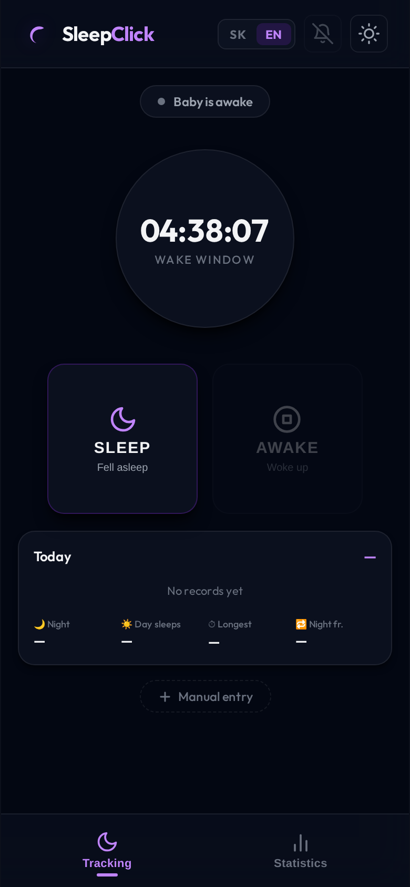
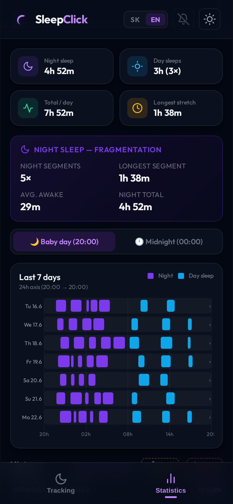

# SleepClick

[](https://github.com/kozliatko/SleepClick/actions/workflows/security.yml)
[](https://github.com/kozliatko/SleepClick/actions/workflows/codeql.yml)
[](https://scorecard.dev/viewer/?uri=github.com/kozliatko/SleepClick)


A progressive web app for tracking a baby's fragmented sleep patterns. Designed for exhausted parents who need to log sleep with one tap — including at 3 AM with one eye open.

<p align="center">
  
  &nbsp;&nbsp;&nbsp;
  
</p>

## Features

### Tracking
- **One-tap tracking** — single SLEEP / AWAKE button pair
- **Live timer** — shows current sleep duration or wake window since last sleep ended
- **Wake-up counter** — log mid-sleep wake-ups without ending the session
- **Manual entry** — add past sessions with exact start/end times
- **Edit records** — correct any past entry including times, tags, notes, and wake-up count

### Sleep visualization
- **Today card** — mini 24h timeline + night sleep, day naps, longest stretch at a glance
- **7-day chart** — scrollable week overview with clickable rows
- **Day detail modal** — full-width timeline for any day with gap labels and per-session list
- **Two day modes**:
  - Baby day (20:00 → 20:00) — groups overnight sleep with the following morning
  - Midnight (00:00 → 00:00) — standard calendar day

### Statistics
- Night sleep total, day nap total, total per day, longest stretch
- **Night fragmentation card** — segment count, longest night stretch, average awake gap, night total
- Cross-midnight sessions are automatically split to the correct day window

### Session tags & notes
Tags: Easy · Crying · Nursed · Pacifier · Stroller · Sick  
Free-text note per session. Tags rendered as chips in history.

### Notifications
- Lock-screen push notification while baby sleeps (via Service Worker)
- Shows elapsed time, updates every 60 s
- "Woke up" action button directly on the notification
- Per-device opt-in/opt-out toggle

### App quality
- **PWA** — installable on iOS and Android home screen
- **Offline-first** — full functionality without network (Service Worker cache)
- **Local fonts** — Outfit loaded from bundled woff2, no CDN dependency
- **Dark / light theme** toggle
- **SK / EN language switcher** — all UI strings translated, persisted per device
- **Export / Import** — JSON backup and restore
- **Mock data** — load 14 days of realistic test data in one tap
- **Clear all** — wipe all records with confirmation

## Tech stack

| Layer | Technology |
|---|---|
| Frontend | Vanilla JS, CSS custom properties |
| PWA | Service Worker (cache-first), Web App Manifest |
| Notifications | Push Notifications API, Service Worker actions |
| Storage | `localStorage` (no backend, no account) |
| Fonts | Outfit (self-hosted woff2) |
| Server | nginx (static file server inside Docker) |
| Deployment | Docker + [caddy-docker-proxy](https://github.com/lucaslorentz/caddy-docker-proxy) |

## Getting started

### Run locally (no Docker)

Open `index.html` directly in a browser. Service Worker requires `localhost` or HTTPS — use a local dev server:

```bash
npx serve .
# or
python3 -m http.server 8080
```

### Run with Docker (standalone)

```bash
docker build -t sleepclick .
docker run -p 8080:80 sleepclick
# open http://localhost:8080
```

### Deploy with caddy-docker-proxy

This is the recommended production setup. Caddy handles TLS automatically.

**Prerequisites:** a running `caddy-docker-proxy` container and an external `caddy` Docker network.

```bash
# one-time network setup (skip if already exists)
docker network create caddy

# configure your domain
cp .env.example .env
echo "CADDY_DOMAIN=sleep.yourdomain.com" > .env

# start
docker compose up -d
```

The app will be available at `https://sleep.yourdomain.com` within seconds.

## Configuration

| Variable | Description | Example |
|---|---|---|
| `CADDY_DOMAIN` | Public domain served by caddy-docker-proxy | `sleep.example.com` |

All user preferences (language, theme, day mode, notification opt-in) are stored in `localStorage` on the device. There is no server-side configuration.

## Data & privacy

SleepClick stores all data exclusively in the browser's `localStorage`. Nothing is sent to any server. Exporting produces a plain JSON file that stays on your device.

## Project structure

```
.
├── index.html          # app shell + all modals
├── app.js              # all application logic
├── i18n.js             # translations (SK / EN)
├── style.css           # design tokens + component styles
├── sw.js               # service worker (cache + notifications)
├── manifest.json       # PWA manifest
├── mock-data.js        # browser-console mock data generator
├── Dockerfile          # nginx static server image
├── nginx.conf          # nginx server block (static files on :80)
├── docker-compose.yml  # caddy-docker-proxy deployment
├── fonts/              # self-hosted Outfit woff2
└── icon*.{svg,png}     # app icons (192, 512, apple-touch-icon)
```

## Contributing

See [CONTRIBUTING.md](CONTRIBUTING.md).

## Changelog

See [CHANGELOG.md](CHANGELOG.md).

## License

MIT
